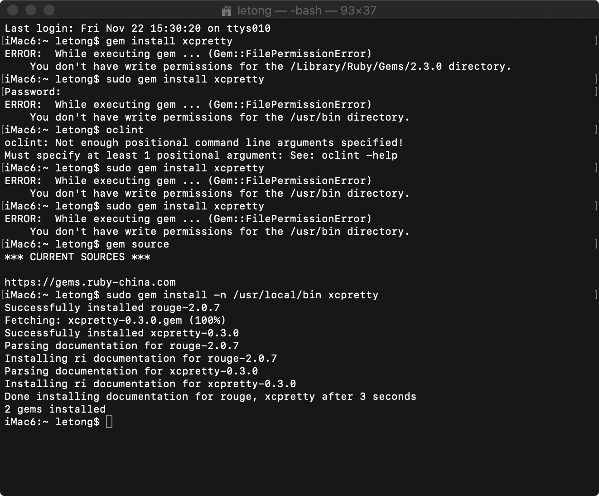
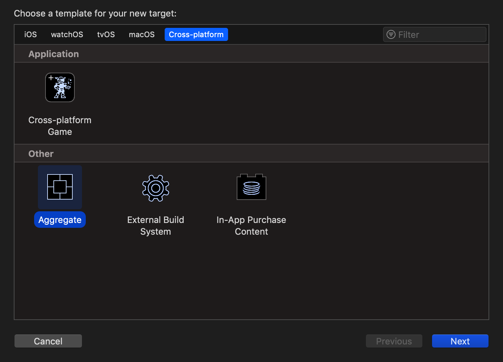
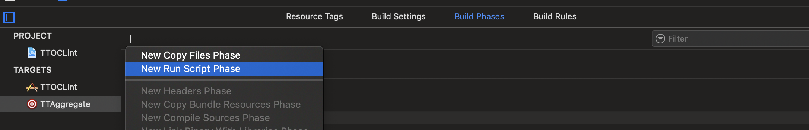
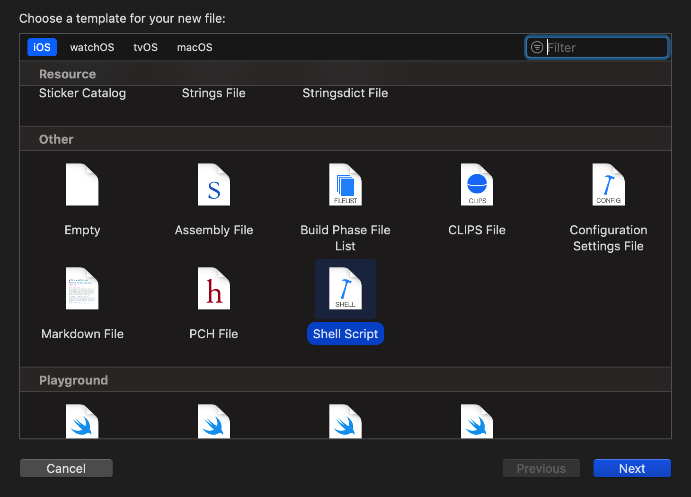
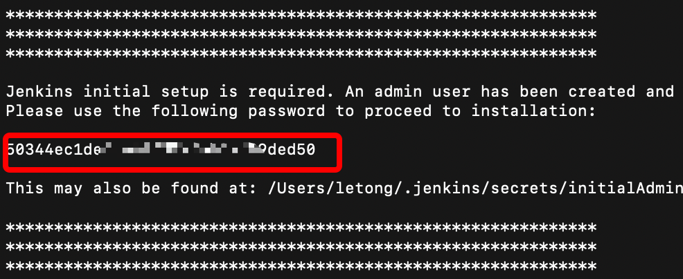
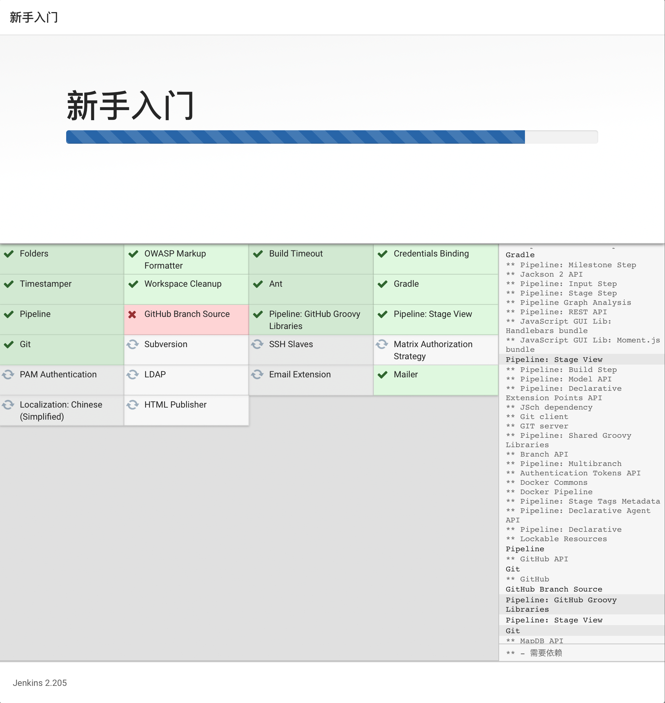
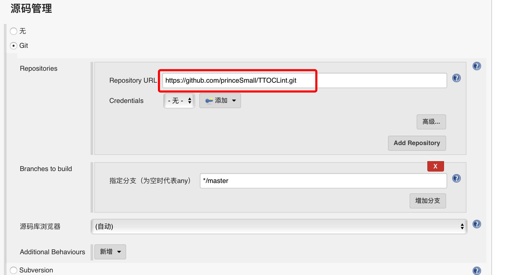
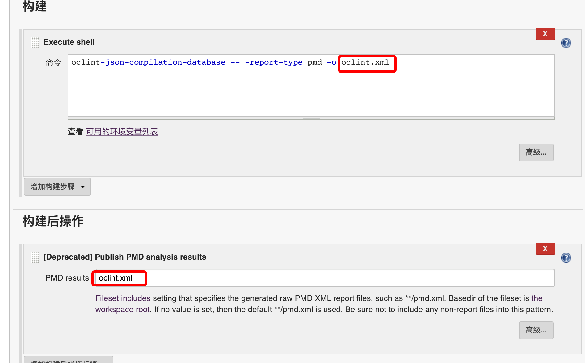
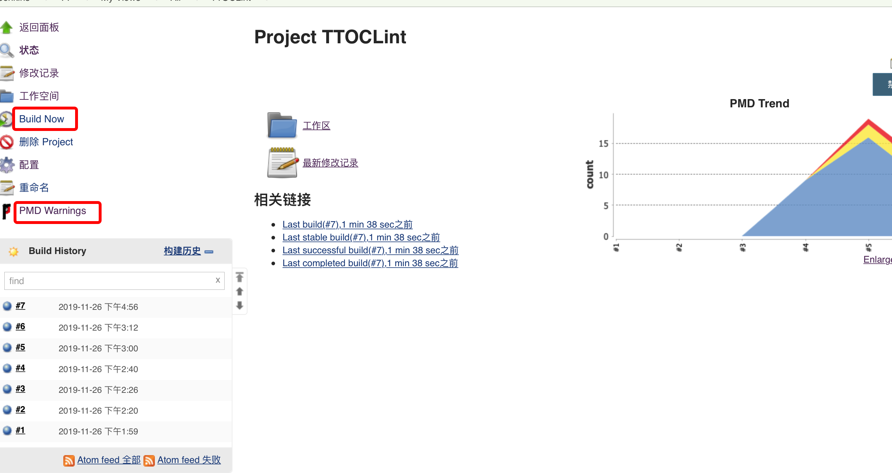
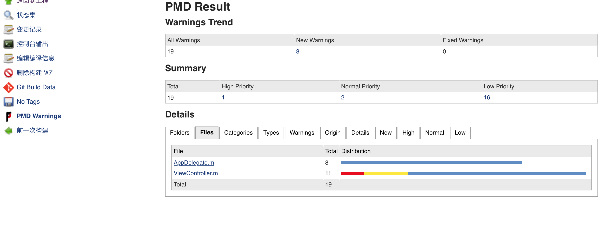

## 使用OCLint + Jenkins集成iOS代码静态分析

### Installing OCLint

```
$ brew tap oclint/formulae
$ brew install oclint

```
### Updating OCLint

```
$ brew update
$ brew upgrade oclint
```

### Installing xcpretty

如果权限问题失败，请使用

```
sudo gem install -n /usr/local/bin xcpretty
```



### Aggregate

1. 新建Aggregate


2. 添加scriptShell


3. 在/bin/sh里写脚本
```
bash ./image/oclint_result.sh
```
4. 新建ScriptShell文件，名称如上oclint_result.sh


5. 在ocllint_result.sh

```
myworkspace=TTOCLint.xcworkspace
myscheme=TTOCLint

# clean cache
rm -rf ~/Library/Developer/Xcode/DerivedData/;
rm compile_commands.json;
rm oclint_result.xml;

# clean -- build -- OCLint analyse
echo 'start analyse';
xcodebuild -workspace $myworkspace -scheme $myscheme clean&&
xcodebuild -workspace $myworkspace -scheme $myscheme \
-configuration Debug GCC_PRECOMPILE_PREFIX_HEADER=YES CLANG_ENABLE_MODULE_DEBUGGING=NO COMPILER_INDEX_STORE_ENABLE=NO \
-destination 'platform=iOS Simulator,name=iPhone X' \

| xcpretty -r json-compilation-database -o compile_commands.json&&
# OCLint的规则 可以通过 -e 参数忽略指定的文件，比如忽略Pods文件夹,AppDelegate.m文件
oclint-json-compilation-database -e Pods -e node_modules -- \
oclint-json-compilation-database -e APPDelegate -- \

-report-type pmd \
-rc LONG_LINE=300 \
-rc LONG_METHOD=200 \
-rc LONG_VARIABLE_NAME=40 \
-rc LONG_CLASS=3000 \
-max-priority-1=1000 \
-max-priority-2=1000 \
-max-priority-3=2000 \
-disable-rule=UnusedMethodParameter \
-disable-rule=AvoidPrivateStaticMembers \
-disable-rule=ShortVariableName \
-allow-duplicated-violations=false >> oclint_result.xml; \
echo 'end analyse';

# echo result
if [ -f ./image/oclint_result.xml ];
then echo 'done';
else echo 'failed';
fi

#通过//!OCLint注释的方式，不让OCLint检查
#可以用 -rc 改变检查规则的默认值
#禁止某一个规则的使用可以使用命令-disable-rule
#OCLint 0.13 includes 71 rules : http://docs.oclint.org/en/stable/rules/index.html

```

6. 打开终端，cd到oclint_result.sh所在的目录，执行

```
chmod 777 oclint_result.sh && ./image/oclint_result.sh

最终在同级目录下会生成compile_commands.json和oclint_result.xml

```

### 集成Jenkins

* 下载启动jenkins

```
下载： brew install jenkins
启动： jenkins -v
```
会出现jenkinsPassword，



* 设置用户账号和密码

游览器打开
```
http://localhost:8080
```
设置jenkins，选择Controls。可以默认选择，也可以选择自己需要的插件，如PMD 。失败也没事，默默等待后，点击完成。



* 设置jenkins插件，选择Manage Jenkins -> Manage Plugins.去选择需要的插件（PMD和EmailExtendedPlugin）or移除不需要的插件

* 新建Item，名称和工程名一致
* 源码管理：我用的是git,输入github地址后，会在构建的时候自动从远程服务器拉最新的代码



* 构建：Execute shell
PMD输出的是shell构建的这个oclint.xml文件


* 去build Now



* 成功后点击PMD Warnings



大功告成！GitHub ：https://github.com/princeSmall/TTOCLint


